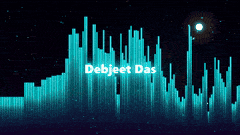

# Neo Cyberpunk Audio Visualizer

Reactive neon audio spectrum visualizer for [Lively Wallpaper](https://www.rocksdanister.com/lively/), with idle synthwave mode and a decoupled background solar system.

## Requirements

- [Lively Wallpaper](https://www.rocksdanister.com/lively/) on Windows
- System audio access enabled in Lively

## Install

1. Download this repo as a `.zip` (GitHub: **Code → Download ZIP**).
2. In Lively: **+ → Open Local File** and select the zip, or extract it and point Lively at `index.html`.

## Features

- Real-time audio-reactive spectrum bars (system audio)
- Idle synthwave / particle mode when no audio is playing
- Customizable accent, bar, and text colors
- Sensitivity, glitch effect, display text, and optional debug HUD
- WebGL bloom/trails with automatic 2D canvas fallback

## Customize

Lively property panel:

- **Display Text** — centered title (max 30 chars)
- **Show Text** — toggle title on/off
- **Neo Light Accent** — glow / particles
- **Visualizer Bar Color** — spectrum bars
- **Text Color** — title color
- **Enable Text Glitch** — periodic RGB-split burst
- **Sync Debug HUD** — raw audio meters (off by default)
- **Visualizer Sensitivity** — audio reactivity (0.2–3.0)

## License

MIT
